# Диаграмма классов библиотеки

## Обзор

Данная диаграмма отображает полную архитектуру библиотеки функциональных блоков для промышленной автоматизации. Диаграмма включает в себя:

- **Обработка сигналов**: дискретные и аналоговые сигналы с различными типами обработки
- **Механизмы**: иерархия классов для управления исполнительными устройствами
- **Управление**: блоки для реализации логики управления
- **Коммуникация**: утилиты для обмена данными и преобразования форматов
- **Диагностика**: блоки для мониторинга и контроля параметров

```mermaid
---
config:
  theme: base
  themeVariables:
    background: '#ffffff'
    primaryColor: '#f8f9fa'
    primaryTextColor: '#212529'
    primaryBorderColor: '#6c757d'
    lineColor: '#495057'
    secondaryColor: '#e9ecef'
    tertiaryColor: '#f8f9fa'
    classText: '#212529'
  layout: elk
---
classDiagram
direction TB
    class FB_BasicSignal {
	    +BOOL ixSignal
	    +GetSignal() BOOL
	    +GetInvertedSignal() BOOL
    }
    class FB_SignalWithTrigger {
	    -R_TRIG _rt_xSignal
	    -F_TRIG _ft_xSignal
	    +GetRtrig() BOOL
	    +GetFtrig() BOOL
    }
    class FB_SignalWithFeedback {
	    +BOOL ixFeedback
	    -FB_SignalWithTrigger _inputSignalTrigger
	    -BOOL _xWaitingFeedback
	    -BOOL _xFeedbackReceived
	    +GetReceivedFeedback() BOOL
	    +GetWaitingFeedback() BOOL
	    +ResetReceivedFeedback()
	    +ResetWaitingFeedback()
    }
    class FB_SignalWithFeedbackTimer {
	    +TIME tFeedbackTimeout
	    -TON _ton_FeedbackTimeout
	    -BOOL _xFeedbackTimeout
	    +GetFeedbackTimeout() BOOL
	    +GetElapsedTime() TIME
	    +IsTimerRunning() BOOL
	    +ResetFeedbackTimeout()
	    +Reset()
    }
    class FB_SignalWithRattling {
	    -TIME _tStabilityTime
	    -UINT _nMaxTransitions
	    -TIME _tDetectionWindow
	    -TON _ton_StabilityFilter
	    -BOOL _xOutSignal
	    -BOOL _xRattlingDetected
	    +GetProcessedSignal() BOOL
	    +GetRattlingDetected() BOOL
	    +GetTransitionCount() UINT
	    +IsDetectionActive() BOOL
	    +ResetRattlingError()
	    +Reset()
    }
    class FB_NumericChangeDetector {
	    +REAL irValue
	    +BOOL qxChangeDetected
	    -REAL _rPreviousValue
	    -BOOL _xFirstCycle
	    -R_TRIG _rt_Change
	    +GetCurrentValue() REAL
	    +GetPreviousValue() REAL
	    +GetValueDifference() REAL
	    +IsValueIncreased() BOOL
	    +IsValueDecreased() BOOL
	    +Reset()
    }
    class FB_BasicAnalogSignal {
	    +REAL irRawValue
	    -REAL _rProcessedValue
	    -REAL _rMinValue
	    -REAL _rMaxValue
	    -BOOL _xOutOfRange
	    +GetRawValue() REAL
	    +GetProcessedValue() REAL
	    +IsOutOfRange() BOOL
	    +GetMinValue() REAL
	    +GetMaxValue() REAL
	    +SetRange(rMinValue : REAL, rMaxValue : REAL)
	    +IsInRange(rValue : REAL) BOOL
	    +ClampToRange(rValue : REAL) REAL
	    +Reset()
	    +ProcessRawValue()*
	    #ValidateRange()
	    #SetProcessedValue(rValue : REAL)
    }
    class FB_AnalogSignal4_20mA {
	    +REAL rScaleMin
	    +REAL rScaleMax
	    +BOOL xEnableRangeProtection
	    -REAL _rCurrentMin
	    -REAL _rCurrentMax
	    -BOOL _xUnderrange
	    -BOOL _xOverrange
	    -BOOL _xWireBreak
	    -BOOL _xOverload
	    -REAL _rWireBreakThreshold
	    -REAL _rOverloadThreshold
	    +ProcessRawValue()
	    +GetScaledValue() REAL
	    +GetPercentValue() REAL
	    +IsWireBreak() BOOL
	    +IsOverload() BOOL
	    +IsUnderrange() BOOL
	    +IsOverrange() BOOL
	    +HasError() BOOL
	    +SetScaleRange(rMin : REAL, rMax : REAL)
	    +GetScaleMin() REAL
	    +GetScaleMax() REAL
	    +Reset()
	    -DiagnoseCurrent()
	    #ClampToRange01(rValue : REAL) REAL
    }
    class FB_UniversalAnalogSignal {
	    +REAL rInputMin
	    +REAL rInputMax
	    +REAL rScaleMin
	    +REAL rScaleMax
	    +BOOL xEnableRangeProtection
	    +BOOL xEnableDiagnostics
	    -BOOL _xSignalUnderrange
	    -BOOL _xSignalOverrange
	    -REAL _rUnderrangeThreshold
	    -REAL _rOverrangeThreshold
	    -BOOL _xCriticalLow
	    -BOOL _xCriticalHigh
	    -REAL _rNormalizedValue
	    -REAL _rPercentValue
	    +ProcessRawValue()
	    +GetScaledValue() REAL
	    +GetNormalizedValue() REAL
	    +GetPercentValue() REAL
	    +GetInputRangePercent() REAL
	    +IsUnderrange() BOOL
	    +IsOverrange() BOOL
	    +IsCriticalLow() BOOL
	    +IsCriticalHigh() BOOL
	    +HasError() BOOL
	    +HasCriticalError() BOOL
	    +IsInValidRange() BOOL
	    +SetInputRange(rMin : REAL, rMax : REAL)
	    +SetScaleRange(rMin : REAL, rMax : REAL)
	    +SetDiagnosticThresholds(rUnderrangePercent : REAL, rOverrangePercent : REAL)
	    +ConfigureAs4_20mA(rProcessMin : REAL, rProcessMax : REAL)
	    +ConfigureAs0_10V(rProcessMin : REAL, rProcessMax : REAL)
	    +ConfigureAs0_20mA(rProcessMin : REAL, rProcessMax : REAL)
	    +ConfigureAsPt100(rTempMin : REAL, rTempMax : REAL)
	    +GetInputMin() REAL
	    +GetInputMax() REAL
	    +GetScaleMin() REAL
	    +GetScaleMax() REAL
	    +GetInputSpan() REAL
	    +GetScaleSpan() REAL
	    +Reset()
	    -DiagnoseSignal()
	    -CalculateAdditionalValues()
	    -LimitTo01(rValue : REAL) REAL
    }
    class FB_RangeDiagnostic_LH {
	    +REAL irValue
	    +REAL irSetpointL
	    +REAL irSetpointLL
	    +REAL irSetpointH
	    +REAL irSetpointHH
	    +BOOL ixEnable
	    +REAL irHysteresis
	    +E_AlarmSetpoints quAlarmCode
	    +BOOL qxAlarmActive
	    +BOOL qxWarningActive
	    +BOOL qxCriticalActive
	    -E_AlarmSetpoints _uPreviousAlarmCode
	    -BOOL _xValidSetpoints
	    -REAL _rHysteresisValue
	    +GetAlarmCode() E_AlarmSetpoints
	    +GetCurrentValue() REAL
	    +IsNormal() BOOL
	    +IsLowAlarm() BOOL
	    +IsHighAlarm() BOOL
	    +AreSetpointsValid() BOOL
	    +GetDistanceToNearestSetpoint() REAL
	    +SetAllSetpoints(rLL : REAL, rL : REAL, rH : REAL, rHH : REAL)
	    +SetSymmetricSetpoints(rCenterValue : REAL, rWarningOffset : REAL, rAlarmOffset : REAL)
	    +SetSetpointsPercent(rMinValue : REAL, rMaxValue : REAL, rLLPercent : REAL, rLPercent : REAL, rHPercent : REAL, rHHPercent : REAL)
	    +Reset()
	    +ForceNormal()
	    -ValidateSetpoints()
	    -ProcessAlarms()
	    -ApplyHysteresis()
	    -UpdateOutputs()
    }
    class E_AlarmSetpoints {
	    Normal
	    L
	    H
	    LL
	    HH
    }
    class FB_AbstractMechanism {
	    -BOOL _xPower
	    +SetPower(BOOL)
	    +GetPower() BOOL
    }
    class FB_Mechanism {
	    +Start()
	    +Stop()
    }
    class FB_MechanismWithFeedback {
	    +BOOL ixFeedback
	    -E_StateFeedback _uFeedbackState
	    +GetFeedbackWithoutPower() BOOL
	    +GetPowerAndFeedback() BOOL
	    +GetPowerWithoutFeedback() BOOL
	    +GetState() E_StateFeedback
	    #UpdateState()
    }
    class E_StateFeedback {
	    Inactive
	    Active
	    Error_NoFeedback
	    Error_UnexpectedFeedback
    }
    class I_Control {
	    +Start()
	    +Stop()
    }
    class FB_BasicControl {
	    +I_Control ControlInterface
	    -BOOL _xConditionToStart
	    -BOOL _xConditionToStop
	    +SetConditionToStart(BOOL)
	    +SetConditionToStop(BOOL)
	    +Start(BOOL)
	    +Stop(BOOL)
    }
    class FB_FrequencyControl {
	    +REAL irMaxFrequency
	    +REAL irStep
	    +REAL qrCurrentFrequency
	    +BOOL qxTargetReached
	    -REAL _rSetFrequency
	    -REAL _rCurrentFrequency
	    -BOOL _xInitialized
	    +Calculate(rStep : REAL, xPulse : BOOL, xConditionToProceed : BOOL)
	    +SetFrequencyTarget(rFrequency : REAL)
	    +SetFrequencyDirect(rFrequency : REAL)
	    +GetCurrentFrequency() REAL
	    +GetTargetFrequency() REAL
	    +Reset()
	    +Hold()
    }
    class U_ByteToWord {
	    +WORD wTag
	    +ARRAY[0..1] OF BYTE bTag
    }
    class U_RealToWord {
	    +ARRAY[0..1] OF WORD wTag
	    +REAL rTag
    }
    class FC_SwapBytesInWord {
	    +FC_SwapBytesInWord(wInputValue : WORD) WORD
    }
    class FC_SwapBytesInWordArray {
	    +FC_SwapBytesInWordArray(awInputArray : ARRAY[0..1] OF WORD) ARRAY[0..1] OF WORD
    }
    class FC_SwapWordArrayElements {
	    +FC_SwapWordArrayElements(awInputArray : ARRAY[0..1] OF WORD) ARRAY[0..1] OF WORD
    }

	<<abstract>> FB_BasicAnalogSignal
	<<enumeration>> E_AlarmSetpoints
	<<abstract>> FB_AbstractMechanism
	<<enumeration>> E_StateFeedback
	<<interface>> I_Control
	<<union>> U_ByteToWord
	<<union>> U_RealToWord
	<<function>> FC_SwapBytesInWord
	<<function>> FC_SwapBytesInWordArray
	<<function>> FC_SwapWordArrayElements

    FB_BasicSignal <|-- FB_SignalWithTrigger
    FB_BasicSignal <|-- FB_SignalWithFeedback
    FB_SignalWithFeedback <|-- FB_SignalWithFeedbackTimer
    FB_BasicSignal <|-- FB_SignalWithRattling
    FB_BasicAnalogSignal <|-- FB_AnalogSignal4_20mA
    FB_BasicAnalogSignal <|-- FB_UniversalAnalogSignal
    FB_AbstractMechanism <|-- FB_Mechanism
    FB_Mechanism <|-- FB_MechanismWithFeedback
    FB_SignalWithFeedback o-- FB_SignalWithTrigger : uses
    FB_RangeDiagnostic_LH o-- E_AlarmSetpoints : uses
    FB_MechanismWithFeedback o-- E_StateFeedback : uses
    FB_BasicControl o-- I_Control : uses
    FB_Mechanism ..|> I_Control : implements
    FC_SwapBytesInWord ..> U_ByteToWord : uses
    FC_SwapBytesInWordArray ..> U_ByteToWord : uses
```

## Описание основных компонентов

### Обработка дискретных сигналов
- **FB_BasicSignal**: Базовый класс для работы с булевыми сигналами
- **FB_SignalWithTrigger**: Детекция фронтов сигналов
- **FB_SignalWithFeedback**: Контроль обратной связи
- **FB_SignalWithFeedbackTimer**: Контроль обратной связи с таймаутом
- **FB_SignalWithRattling**: Фильтрация дребезга контактов

### Обработка аналоговых сигналов
- **FB_BasicAnalogSignal**: Абстрактный базовый класс для аналоговых сигналов
- **FB_AnalogSignal4_20mA**: Специализированный блок для токовой петли 4-20 мА
- **FB_UniversalAnalogSignal**: Универсальный блок для любых аналоговых сигналов

### Диагностика
- **FB_RangeDiagnostic_LH**: Контроль параметров с четырехуровневой системой аварий
- **FB_NumericChangeDetector**: Обнаружение изменений числовых значений

### Механизмы и управление
- **FB_AbstractMechanism**: Абстрактный базовый класс механизмов
- **FB_Mechanism**: Базовая реализация механизма
- **FB_MechanismWithFeedback**: Механизм с диагностикой обратной связи
- **FB_BasicControl**: Базовое управление с условиями
- **FB_FrequencyControl**: Управление частотными преобразователями

### Коммуникация
- **U_ByteToWord**, **U_RealToWord**: Объединения для преобразования типов данных
- **FC_SwapBytes...**: Функции для работы с порядком байтов в протоколах связи

### Интерфейсы и перечисления
- **I_Control**: Стандартный интерфейс управления
- **E_AlarmSetpoints**: Уровни аварий и предупреждений
- **E_StateFeedback**: Состояния обратной связи механизмов

## Принципы архитектуры

### Иерархия наследования
Библиотека построена на принципах объектно-ориентированного программирования:
- **Абстрактные базовые классы** определяют общий интерфейс и основную функциональность
- **Производные классы** расширяют базовую функциональность для специфических задач
- **Интерфейсы** обеспечивают единообразие управления различными типами устройств

### Композиция и агрегация
- Сложные блоки используют более простые как компоненты
- Например, `FB_SignalWithFeedback` использует `FB_SignalWithTrigger` для детекции фронтов

### Полиморфизм
- Единый интерфейс `I_Control` позволяет управлять различными механизмами одинаково
- Абстрактные методы обеспечивают специфичную реализацию в производных классах